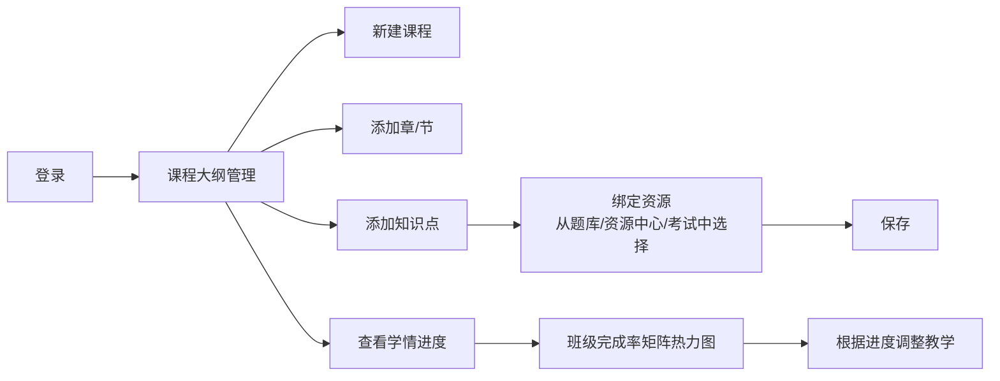

# 课程大纲（Curriculum）功能实施方案

> 时间：2026-05-30  
> 项目：SmartKBS  
> 目标：为系统增加课程→章/节→知识点四级树形大纲体系，形成教与学的主线

---

## 一、背景与目标

### 1.1 现状分析

SmartKBS 已有丰富功能（AI 对话、题库、考试、资源管理、课堂互动、分组讨论、点名、积分、任务、通知公告等），但**缺乏一条贯穿教与学的主线**。

- 资源和活动分散在各自模块中，学生没有清晰的学习路线图
- `question_bank` 表仅用文本字段 `knowledge_points` 存储标签，无规范化课程结构
- 教师无法按章、节、知识点来组织教学内容和资源

### 1.2 核心目标

- 建立 **课程 → 章 → 节 → 知识点** 四级树形结构
- 支持管理员/教师**动态发布、更新和组织**
- 学生可以**沿着主线**进行学习，查看关联资源
- 记录**学习进度**，形成教与学的闭环

---

## 二、数据层设计

### 2.1 数据库选型

继续使用 SQLite（`smartkb.db`），在 `backend/database.py` 的 `init_db()` 中追加建表语句。保持与现有架构一致，课程数据量不会成为瓶颈。

### 2.2 新建 5 张表

#### 2.2.1 `courses` — 课程表

```sql
CREATE TABLE IF NOT EXISTS courses (
    id INTEGER PRIMARY KEY AUTOINCREMENT,
    name TEXT NOT NULL,              -- 课程名称，如"信息技术"、"通用技术"
    code TEXT DEFAULT '',            -- 课程代码，如 "IT"、"GT"
    description TEXT DEFAULT '',     -- 课程简介
    grade TEXT DEFAULT '',           -- 适用年级，如"高一"、"高二"、"高一|高二"
    cover_image TEXT DEFAULT '',     -- 封面图 URL
    sort_order INTEGER DEFAULT 0,   -- 排序号
    status TEXT DEFAULT 'active',    -- active | inactive
    created_at TEXT NOT NULL,
    updated_at TEXT NOT NULL
);
```

#### 2.2.2 `chapters` — 章/节表（自引用 parent_id，支持无限嵌套）

```sql
CREATE TABLE IF NOT EXISTS chapters (
    id INTEGER PRIMARY KEY AUTOINCREMENT,
    course_id INTEGER NOT NULL REFERENCES courses(id),
    parent_id INTEGER DEFAULT NULL REFERENCES chapters(id),  -- NULL=顶层章, 非NULL=子节
    name TEXT NOT NULL,              -- 名称，如"第一章 走进技术世界"、"1.1 技术与人"
    description TEXT DEFAULT '',     -- 章节描述/导学
    sort_order INTEGER DEFAULT 0,   -- 排序号
    status TEXT DEFAULT 'active',    -- active | inactive
    created_at TEXT NOT NULL,
    updated_at TEXT NOT NULL
);
```

#### 2.2.3 `knowledge_points` — 知识点表（叶子节点）

```sql
CREATE TABLE IF NOT EXISTS knowledge_points (
    id INTEGER PRIMARY KEY AUTOINCREMENT,
    chapter_id INTEGER NOT NULL REFERENCES chapters(id),
    name TEXT NOT NULL,              -- 知识点名称，如"技术的性质"
    description TEXT DEFAULT '',     -- 详细描述
    learning_objectives TEXT DEFAULT '',  -- 学习目标（可存 JSON 数组或 Markdown）
    difficulty TEXT DEFAULT 'medium',    -- easy | medium | hard
    estimated_minutes INTEGER DEFAULT 0, -- 预计学习时长（分钟）
    sort_order INTEGER DEFAULT 0,   -- 排序号
    status TEXT DEFAULT 'active',    -- active | inactive
    created_at TEXT NOT NULL,
    updated_at TEXT NOT NULL
);
```

#### 2.2.4 `curriculum_bindings` — 课程资源绑定表

```sql
CREATE TABLE IF NOT EXISTS curriculum_bindings (
    id INTEGER PRIMARY KEY AUTOINCREMENT,
    knowledge_point_id INTEGER NOT NULL REFERENCES knowledge_points(id),
    resource_type TEXT NOT NULL,      -- 'html' | 'download' | 'question' | 'exam' |
                                     -- 'discussion' | 'interaction_quiz' | 'task'
    resource_id INTEGER NOT NULL,    -- 对应资源表中的 ID
    sort_order INTEGER DEFAULT 0,
    created_at TEXT NOT NULL,
    UNIQUE(knowledge_point_id, resource_type, resource_id)
);
```

#### 2.2.5 `learning_progress` — 学生学习进度表

```sql
CREATE TABLE IF NOT EXISTS learning_progress (
    id INTEGER PRIMARY KEY AUTOINCREMENT,
    student_username TEXT NOT NULL REFERENCES users(username),
    knowledge_point_id INTEGER NOT NULL REFERENCES knowledge_points(id),
    status TEXT DEFAULT 'not_started',  -- not_started | in_progress | completed
    score REAL DEFAULT 0,               -- 学习评分（如测验得分）
    completed_at TEXT DEFAULT NULL,
    updated_at TEXT NOT NULL,
    UNIQUE(student_username, knowledge_point_id)
);
```

### 2.3 索引

```sql
CREATE INDEX IF NOT EXISTS idx_chapters_course ON chapters(course_id);
CREATE INDEX IF NOT EXISTS idx_chapters_parent ON chapters(parent_id);
CREATE INDEX IF NOT EXISTS idx_kp_chapter ON knowledge_points(chapter_id);
CREATE INDEX IF NOT EXISTS idx_cb_kp ON curriculum_bindings(knowledge_point_id);
CREATE INDEX IF NOT EXISTS idx_cb_type ON curriculum_bindings(resource_type, resource_id);
CREATE INDEX IF NOT EXISTS idx_lp_student ON learning_progress(student_username);
CREATE INDEX IF NOT EXISTS idx_lp_kp ON learning_progress(knowledge_point_id);
```

---

## 三、后端 API 设计

### 3.1 新增文件

`backend/api/curriculum_router.py`，遵循 `exam_router.py` 的代码风格：

- pydantic Request/Response 模型
- `get_current_user(request)` 权限校验
- SQLite 原生查询（复用 `backend.database` 的工具函数）

### 3.2 路由注册

在 `backend/main.py` 中添加：

```python
from backend.api.curriculum_router import router as curriculum_router
app.include_router(curriculum_router, prefix="/api/curriculum", tags=["curriculum"])
```

### 3.3 API 端点清单

#### 课程 CRUD

| 方法 | 路径 | 说明 | 权限 |
| ------ | ------ | ------ | ------ |
| GET | `/api/curriculum/courses` | 课程列表（支持筛选 grade/status） | 所有登录用户 |
| GET | `/api/curriculum/courses/{id}` | 课程详情（含完整树结构） | 所有登录用户 |
| POST | `/api/curriculum/courses` | 创建课程 | admin/teacher |
| PUT | `/api/curriculum/courses/{id}` | 更新课程 | admin/teacher |
| DELETE | `/api/curriculum/courses/{id}` | 删除课程（级联下线子节点） | admin |

#### 章节 CRUD

| 方法 | 路径 | 说明 | 权限 |
| ------ | ------ | ------ | ------ |
| GET | `/api/curriculum/chapters/{id}` | 章节详情（含子节点和知识点） | 所有登录用户 |
| POST | `/api/curriculum/chapters` | 创建章节 | admin/teacher |
| PUT | `/api/curriculum/chapters/{id}` | 更新章节 | admin/teacher |
| DELETE | `/api/curriculum/chapters/{id}` | 删除章节（级联下线子节点） | admin/teacher |

#### 知识点 CRUD

| 方法 | 路径 | 说明 | 权限 |
| ------ | ------ | ------ | ------ |
| GET | `/api/curriculum/knowledge-points/{id}` | 知识点详情 | 所有登录用户 |
| POST | `/api/curriculum/knowledge-points` | 创建知识点 | admin/teacher |
| PUT | `/api/curriculum/knowledge-points/{id}` | 更新知识点 | admin/teacher |
| DELETE | `/api/curriculum/knowledge-points/{id}` | 删除知识点 | admin/teacher |

#### 资源绑定

| 方法 | 路径 | 说明 | 权限 |
| ------ | ------ | ------ | ------ |
| GET | `/api/curriculum/knowledge-points/{id}/resources` | 获取绑定的资源列表 | 所有登录用户 |
| POST | `/api/curriculum/bindings` | 绑定资源到知识点 | admin/teacher |
| DELETE | `/api/curriculum/bindings/{id}` | 解绑资源 | admin/teacher |
| GET | `/api/curriculum/bindings/available` | 获取可绑定的候选资源（按类型筛选） | admin/teacher |

#### 学习进度

| 方法 | 路径 | 说明 | 权限 |
| ------ | ------ | ------ | ------ |
| GET | `/api/curriculum/progress` | 学生查看自己的全部进度 | student |
| PUT | `/api/curriculum/progress/{kp_id}` | 更新单个知识点的学习状态 | student |
| GET | `/api/curriculum/progress/stats` | 课程维度进度统计 | student |
| GET | `/api/curriculum/progress/overview` | 班级进度总览（教师用） | teacher/admin |

#### 完整树查询（核心端点）

| 方法 | 路径 | 说明 | 权限 |
| ------ | ------ | ------ | ------ |
| GET | `/api/curriculum/tree` | 全部课程完整树（course→chapter→kp） | 所有登录用户 |

### 3.4 树查询实现思路

```text
GET /api/curriculum/tree
1. 查 courses → 按 grade 匹配当前用户
2. foreach course: 查 chapters WHERE course_id=? AND parent_id IS NULL → 按 sort_order 排序
3. foreach chapter: 查子章节 + 查 knowledge_points → 按 sort_order 排序
→ 返回嵌套 JSON
```

学生版本额外查询 `learning_progress` 注入 `progress_status`。

---

## 四、前端设计

### 4.1 新增类型定义

在 `frontend/src/types/index.ts` 追加：

```typescript
export interface Course {
  id: number;
  name: string;
  code: string;
  description: string;
  grade: string;
  cover_image: string;
  sort_order: number;
  status: string;
  created_at: string;
  updated_at: string;
  chapters?: ChapterTreeNode[];
  progress?: { total: number; completed: number };
}

export interface ChapterTreeNode {
  id: number;
  course_id: number;
  parent_id: number | null;
  name: string;
  description: string;
  sort_order: number;
  status: string;
  children?: ChapterTreeNode[];
  knowledge_points?: KnowledgePoint[];
}

export interface KnowledgePoint {
  id: number;
  chapter_id: number;
  name: string;
  description: string;
  learning_objectives: string;
  difficulty: string;
  estimated_minutes: number;
  sort_order: number;
  status: string;
  progress_status?: 'not_started' | 'in_progress' | 'completed';
  resource_count?: number;
  resources?: CurriculumResource[];
}

export interface CurriculumResource {
  id: number;
  binding_id: number;
  knowledge_point_id: number;
  resource_type: string;
  resource_id: number;
  resource_name: string;
  sort_order: number;
  created_at: string;
}
```

### 4.2 新增 API 模块

`frontend/src/api/curriculum.ts`，遵循 `exams.ts` 模式，使用 `apiClient`（axios 实例）。

### 4.3 新增页面

#### 4.3.1 `CurriculumPage.tsx` — 课程大纲主页

**学生视图：**

- 顶部：课程 Tab 切换（根据年级匹配）
- 主体：Ant Design Tree 展示课程→章→节→知识点
- 每个知识点节点附带：难度标签、预计时长、完成状态图标
- 点击知识点 → 跳转详情页 `/curriculum/knowledge-point/{id}`
- 搜索框：按知识点名称全局搜索
- 进度卡片：该课程已完成/总知识点数

**教师/管理员视图：**

- 与上述结构一致，额外增加：
  - 课程级别：添加、编辑、删除按钮
  - 章节/知识点级别：每个节点右侧 hover 出现操作按钮（添加子节点、编辑、删除、上移/下移）
  - 顶部"新建课程"按钮 → 弹出 Modal 表单
  - 批量导入按钮（可选）

#### 4.3.2 `CurriculumDetailPage.tsx` — 知识点学习详情页

- 面包屑导航：课程 → 章 → 节 → 知识点
- 知识点信息区：名称、描述、学习目标、难度、预计时长
- 资源 Tab 列表（按 `resource_type` 分组）：
  - 📄 **HTML 资源** — 可内嵌 iframe 预览
  - 📥 **下载文件** — 文件列表，可下载
  - ❓ **关联试题** — 可在线练习（调用 `POST /api/questions/generate-practice`）
  - 📝 **关联考试** — 可直接参加考试
  - 💬 **关联讨论** — 跳转讨论室
  - 📋 **关联任务** — 查看/提交任务
- 学习进度按钮：
  - "开始学习" → 状态改为 in_progress
  - "标记已完成" → 状态改为 completed
  - 进度条可视化

#### 4.3.3 `CurriculumProgressPage.tsx` — 学情进度总览（教师/管理员）

- 顶部筛选：年级、班级、课程
- 核心组件：知识点 × 学生 完成状态矩阵（热力图）
  - 行 = 学生列表，列 = 知识点
  - 单元格颜色表示状态（绿=完成、黄=进行中、灰=未开始）
- 统计卡片：全班平均完成率、各课程完成率排名
- 导出 CSV/Excel 按钮（可选）

### 4.4 新增组件

#### `CurriculumTree.tsx`

可复用的课程树组件，封装：

- 树渲染逻辑（Ant Design `<Tree>`）
- 节点图标（按类型和状态）
- 教师模式的操作按钮
- 排序拖拽（可选）

#### `ResourceBinder.tsx`

资源绑定器组件，用于教师将现有资源关联到知识点：

- 选择资源类型（下拉框）
- 搜索/筛选对应类型的资源列表
- 多选 → 确认绑定

### 4.5 路由注册

在 `frontend/src/App.tsx` 中添加：

```tsx
import CurriculumPage from './pages/CurriculumPage'
import CurriculumDetailPage from './pages/CurriculumDetailPage'

// 在 <Route path="/" element={...}> 内部添加：
<Route path="curriculum" element={<CurriculumPage />} />
<Route path="curriculum/knowledge-point/:kpId" element={<CurriculumDetailPage />} />
<Route path="curriculum/progress" element={user?.role === 'teacher' || user?.role === 'admin' ? <CurriculumProgressPage /> : <Navigate to="/curriculum" />} />
```

### 4.6 菜单修改

在 `frontend/src/components/AppLayout.tsx` 中：

**学生菜单** — "💡 学习"分组增加：

```typescript
{ key: '/curriculum', icon: <BookOutlined />, label: '课程大纲' }
```

**教师菜单** — "💡 教学"分组增加：

```typescript
{ key: '/curriculum', icon: <BookOutlined />, label: '课程大纲' }
{ key: '/curriculum/progress', icon: <BarChartOutlined />, label: '学情进度' }
```

需要从 `@ant-design/icons` 引入 `BookOutlined`。

### 4.7 仪表盘集成

在 `DashboardPage.tsx` 中增加：

- **学生版**："我的学习进度"卡片 — 显示各课程知识点完成率 + 最近学习知识点
- **教师版**："教学进度概览"卡片 — 显示各班级课程完成率排名

---

## 五、现有功能集成点

### 5.1 题库集成

- `question_bank` 表增加可选外键：`knowledge_point_id INTEGER DEFAULT NULL`
- 在 `question_db.py` 的 `init_question_db()` 中执行兼容性 ALTER TABLE
- 题库管理页面增加"关联知识点"下拉选择器
- 知识点详情页可展示关联试题，并提供在线练习模式

### 5.2 考试集成

- `exams` 表或 `curriculum_bindings` 绑定考试到知识点
- 知识点详情页可跳转参加关联考试

### 5.3 资源中心集成

- HTML 资源和下载资源均可绑定到知识点
- 知识点详情页内嵌 iframe 预览 HTML 资源
- 资源管理页可过滤显示某知识点下的资源

### 5.4 讨论集成

- `discussions` 可绑定到知识点，形成"课堂讨论"入口
- 知识点详情页展示关联讨论

### 5.5 任务集成

- `tasks` 可绑定到知识点，作为课后作业入口
- 知识点详情页展示关联任务

---

## 六、实施步骤

### Phase 1：数据层 + 基础 API（核心骨架）

| 步骤 | 内容 | 预计工时 |
| ------ | ------ | ---------- |
| 1.1 | `database.py` 追加 5 张新表 CREATE + 索引 | 0.5天 |
| 1.2 | `curriculum_router.py`：课程 CRUD（4个端点） | 0.5天 |
| 1.3 | 章节 CRUD + 知识点 CRUD（6个端点） | 0.5天 |
| 1.4 | `GET /tree` 完整树查询 | 0.5天 |
| 1.5 | 注册路由到 `main.py`，初步测试 | 0.5天 |
| | **小计** | **2.5天** |

### Phase 2：前端基础页面（学生学习主线）

| 步骤 | 内容 | 预计工时 |
| ------ | ------ | ---------- |
| 2.1 | 追加 `types/index.ts` 类型定义 | 0.2天 |
| 2.2 | 新建 `api/curriculum.ts` API 模块 | 0.3天 |
| 2.3 | `CurriculumPage.tsx` 学生视图 | 1.5天 |
| 2.4 | `CurriculumDetailPage.tsx` 知识点详情 | 1天 |
| 2.5 | 菜单修改 + 路由注册 | 0.3天 |
| | **小计** | **3.3天** |

### Phase 3：教师管理界面（动态维护）

| 步骤 | 内容 | 预计工时 |
| ------ | ------ | ---------- |
| 3.1 | 课程管理（增删改 Modal 表单） | 0.5天 |
| 3.2 | 章节/知识点树节点操作按钮 | 1天 |
| 3.3 | 拖拽排序或上下箭头排序 | 0.5天 |
| | **小计** | **2天** |

### Phase 4：资源绑定

| 步骤 | 内容 | 预计工时 |
| ------ | ------ | ---------- |
| 4.1 | 资源绑定/解绑/查询 API 端点 | 0.5天 |
| 4.2 | `ResourceBinder.tsx` 组件 | 1天 |
| 4.3 | 知识点详情页资源列表展示 | 0.5天 |
| 4.4 | 题库 `knowledge_point_id` 迁移（可选） | 0.5天 |
| | **小计** | **2.5天** |

### Phase 5：学习进度 + 学情统计

| 步骤 | 内容 | 预计工时 |
| ------ | ------ | ---------- |
| 5.1 | 进度 API（GET/PUT progress + overview） | 0.5天 |
| 5.2 | 学生视图进度可视化（徽章、进度条） | 0.5天 |
| 5.3 | `CurriculumProgressPage.tsx` 班级热力图 | 1.5天 |
| 5.4 | 仪表盘集成进度卡片 | 0.5天 |
| | **小计** | **3天** |

### Phase 6：打磨与集成

| 步骤 | 内容 | 预计工时 |
| ------ | ------ | ---------- |
| 6.1 | 知识点搜索功能 | 0.5天 |
| 6.2 | 课程封面图上传 | 0.5天 |
| 6.3 | 批量导入课程模板 | 1天 |
| 6.4 | 权限边界处理 | 0.5天 |
| 6.5 | 全链路测试 | 1天 |
| | **小计** | **3.5天** |

### 总计

| Phase | 内容 | 工时 |
| ------ | ------ | ------ |
| Phase 1 | 数据层 + API 骨架 | 2.5天 |
| Phase 2 | 学生前端页面 | 3.3天 |
| Phase 3 | 教师管理界面 | 2天 |
| Phase 4 | 资源绑定 | 2.5天 |
| Phase 5 | 学情进度 | 3天 |
| Phase 6 | 打磨集成 | 3.5天 |
| **总计** | | **~17天** |

---

## 七、关键设计决策

| 决策 | 选择 | 理由 |
| ------ | ------ | ------ |
| 章节模型 | 单表 `chapters` + `parent_id` 支持无限嵌套 | 灵活，避免章/节硬编码 |
| 资源绑定 | 独立 `curriculum_bindings` 表 + `resource_type` 枚举 | 零侵入现有资源表，松耦合，易于扩展 |
| 数据库 | 继续 SQLite（`smartkb.db` 建表） | 与现有架构一致，课程数据量不大 |
| 知识点与题库关联 | 兼容旧文本字段 + 可选 FK | 不破坏现有数据，逐步迁移 |
| 前端框架 | Ant Design Tree + Tabs + Modal | 复用现有 UI 组件，树适合大纲展示 |
| 学习进度粒度 | 知识点级别 | 够用且简单，不过度设计 |
| 学生匹配课程 | 按 `users.grade` 字段筛选 | 已有年级字段，无需额外配置 |

---

## 八、涉及文件清单

### 后端（5 个）

| 文件 | 操作 |
| ------ | ------ |
| `backend/database.py` | 追加 5 张表 CREATE + 索引 |
| `backend/question_db.py` | 追加 `knowledge_point_id` 列（可选） |
| `backend/api/curriculum_router.py` | **新建** — 全部 ~20 个 API 端点 |
| `backend/main.py` | 注册 curriculum_router |
| `backend/api/dashboard_router.py` | 追加课程进度统计 |

### 前端（15 个）

| 文件 | 操作 |
| ------ | ------ |
| `frontend/src/types/index.ts` | 追加 Course, ChapterTreeNode, KnowledgePoint 等 |
| `frontend/src/api/curriculum.ts` | **新建** — 所有 API 调用函数 |
| `frontend/src/pages/CurriculumPage.tsx` | **新建** — 课程大纲主页 |
| `frontend/src/pages/CurriculumDetailPage.tsx` | **新建** — 知识点学习页 |
| `frontend/src/pages/CurriculumProgressPage.tsx` | **新建** — 学情进度总览 |
| `frontend/src/components/CurriculumTree.tsx` | **新建** — 课程树组件 |
| `frontend/src/components/ResourceBinder.tsx` | **新建** — 资源绑定组件 |
| `frontend/src/components/AppLayout.tsx` | 追加菜单项 |
| `frontend/src/App.tsx` | 注册新路由 |
| `frontend/src/pages/DashboardPage.tsx` | 集成进度卡片（可选） |
| `frontend/src/pages/QuestionBankPage.tsx` | 增加知识点选择器（可选） |
| `frontend/src/pages/ResourceMgmtPage.tsx` | 增加知识点关联（可选） |
| `frontend/src/api/resources.ts` | 追加知识点筛选参数（可选） |
| `frontend/src/api/questions.ts` | 追加知识点筛选参数（可选） |
| `frontend/src/api/exams.ts` | 追加知识点筛选参数（可选） |

---

## 九、用户体验流程

### 学生视角

```mermaid
flowchart LR
    A[登录] --> B[课程大纲首页]
    B --> C{选择课程 Tab}
    C --> D[查看课程树]
    D --> E[点击知识点]
    E --> F[知识点详情页]
    F --> G[浏览绑定资源<br/>HTML/试题/考试/讨论/任务]
    F --> H[在线练习]
    F --> I[标记"已完成"]
    I --> J[进度自动更新]
    J --> D
```

### 教师视角



---

## 十、暂不包含的范围

- 知识点前置依赖/拓扑排序（后续可扩展为"学习路线图"）
- AI 自动生成备课教案（后续可与 AI 对话结合）
- 学生学习详细时间记录（超出进度标记的粒度）
- 移动端适配（当前项目无此需求）
- 多人实时协作编辑大纲（复杂度高，可先用加锁机制）
- 课程版本管理/历史变更追溯

---

*本文档为 SmartKBS 课程大纲功能的完整实施方案，可根据实际情况调整优先级和范围。*
